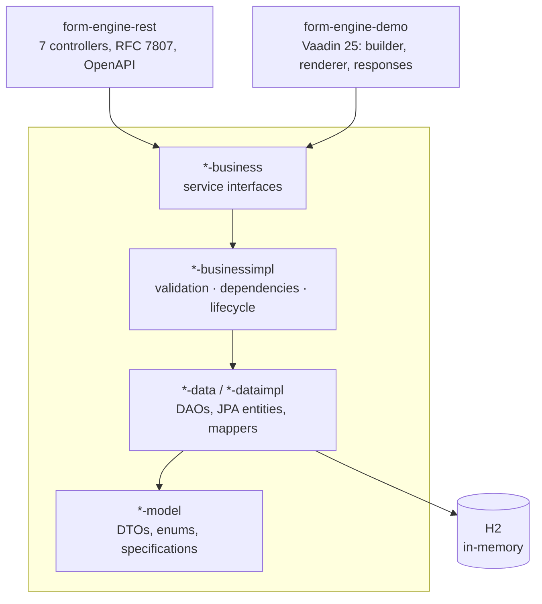

# Form Engine

[](https://github.com/Nc707/form-engine/actions/workflows/ci.yml)

A form engine whose forms are **defined at runtime, not at compile time**. A form definition owns its
fields, their options, their validation rules and the conditional dependencies between them; people
fill those forms in and their answers are stored against the exact version of the definition they saw.

Adding a rule to a form is an edit to data. No deployment, no code.

Java 21, Spring Boot 4.0.2, Vaadin 25, Maven multi-module, H2 in-memory.

## What it does

**Validation is data.** A field carries a list of restrictions — `MIN_LENGTH`, `PATTERN`, `EMAIL` and
so on — which are turned into composable `FieldSpecification` objects at evaluation time. Two things
are deliberately *not* restrictions, because they are always true and so would be nothing to configure:
whether an answer is required at all, and whether a choice is one the field offers. See
[the specification guide](form-engine-definition-model/src/main/java/com/nc/formengine/model/specification/README.md).

**The engine owns its rules.** A form's coherence — field names usable as keys and unique within the
form, a select with options, an option value no answer could ambiguate, a rule that applies to its
field's type and carries the parameter it needs — is enforced in the business layer. The REST API and
the Vaadin UI are two consumers of it, held to the same standard; the builder asks the same questions
early so a problem is a message beside the field rather than an exception after pressing save.

**Fields react to each other.** A dependency says "while field A `EQUALS` *x*, `SHOW` / `REQUIRE`
field B". The evaluator resolves the whole graph, detects cycles, and where two satisfied rules
disagree the more restrictive one wins — so the outcome never depends on load order and a
misconfigured form fails closed.

**Definitions have a lifecycle.** A `DRAFT` is editable, and cannot be published while it has no fields.
Publishing freezes it *whole* — not only its own row but its fields, their options, their rules and its
layouts — and archives whichever version was live before, so exactly one version per code accepts
submissions at a time. Changing a published form means creating a new version, which deep-copies
everything and repoints the references onto the copies. Old submissions stay readable against the
definition they were actually filled under, which is the point of freezing rather than editing in place.

**Submissions have a state machine.** `DRAFT → SUBMITTED → VOIDED`, and `DRAFT → DISCARDED`. The two
endings are different acts by different people: a draft is *discarded* by whoever was filling it in,
nothing having been sent; a received response is *voided* by whoever owns the form, its answers staying
readable. Which one applies follows from where you are, so neither needs to be told who is asking.

Submitting validates strictly inside the transaction that writes, so a stored `SUBMITTED` row is
always one its own definition would accept — and it stays that way, because the state is the
lifecycle's alone and a submitted response's answers can no longer be edited. An invalid submit is not
an exception — being told which fields to fix is the normal outcome — so it comes back as a result
carrying the errors, with nothing written.

## Architecture

The project is sliced by domain, then by layer. The REST API and the Vaadin UI are two consumers of
the same business core; neither owns engine logic.



Each of `definition` and `submission` has its own `model / data / dataimpl / business / businessimpl`
column. The submission slice reaches into the definition slice in exactly one place — the submission
workflow needs to validate against a definition — and only at the business layer, one way. The
entities on both sides stay decoupled: a submission stores a plain `formDefinitionId` with no foreign
key.

| Module | What lives there |
|---|---|
| `*-model` | DTOs, enums, domain exceptions, the specification framework |
| `*-data` | DAO interfaces |
| `*-dataimpl` | JPA entities, repositories, mappers, DAO implementations |
| `*-business` | Service interfaces |
| `*-businessimpl` | Service implementations |
| `form-engine-rest` | REST API — port 8080, context path `/form-engine` |
| `form-engine-demo` | Vaadin UI — port 8081, injects the services directly (no HTTP) |

## Running it

```bash
mvn clean install                          # full build with every test
mvn spring-boot:run -pl form-engine-demo   # Vaadin UI  → http://localhost:8081
mvn spring-boot:run -pl form-engine-rest   # REST API   → http://localhost:8080/form-engine
```

The UI seeds two demo forms on startup, so there is something to look at immediately:

| View | What it is |
|---|---|
| **Form builder** | Design a form: fields, restrictions, options, conditional dependencies, live preview, publish, version |
| **Fill a form** | Render a published form on its layout grid, react to dependencies as you type, save a draft, submit |
| **Responses** | Browse and filter submissions, read one in full, export CSV, discard a draft or void a response |
| **Responses by form** | One form's submissions, with a per-status summary |

Two notes on partial builds:

- Always pass `-am` when building a single module (`mvn verify -pl form-engine-rest -am`). Without it
  Maven resolves the siblings from `~/.m2` instead of the reactor, and a stale `0.0.1-SNAPSHOT`
  installed there gets used instead of your working tree.
- `mvn -Pproduction ...` compiles the Vaadin frontend bundle. It is a separate profile on purpose:
  the default build must not need a Node toolchain.

## API documentation

With the REST module running:

- Swagger UI — <http://localhost:8080/form-engine/swagger-ui.html>
- OpenAPI document — <http://localhost:8080/form-engine/v3/api-docs>

Endpoints are grouped under seven tags, all below `/api/v1`:

| Base path | Resource |
|---|---|
| `/api/v1/form-definitions` | Forms: code, title, version, status |
| `/api/v1/field-definitions` | The fields of a form |
| `/api/v1/field-options` | Options of `SELECT` / `MULTI_SELECT` fields |
| `/api/v1/field-dependencies` | Show/hide/require rules between fields |
| `/api/v1/form-layouts` | Per-device grid layouts, with fallback resolution |
| `/api/v1/form-submissions` | Filled-in instances of a form |
| `/api/v1/field-submissions` | The individual answers inside a submission |

The lifecycle and validation operations are deliberately **not** exposed over REST — they are driven
through the Vaadin UI against the same service interfaces. That is a choice about surface area, not a
gap the CRUD endpoints quietly fill: they cannot move a submission between states. Creating one always
yields a `DRAFT`, whatever status the request names, and submitting, discarding and voiding exist only
on the workflow service, which validates and checks that the form still accepts answers.

## Error model

Errors are RFC 7807 problem details, served as `application/problem+json` by a single
`@RestControllerAdvice` (`GlobalExceptionHandler`).

| Status | When |
|---|---|
| `400` | Bean Validation failed, a path variable had the wrong type, the body was unreadable, or a domain argument was invalid |
| `404` | The addressed resource, or one it references, does not exist |
| `409` | Something is already taken — a form code, a field name within its form, an option value within its field — or the request is against the state: editing any part of a published form, publishing twice, versioning a draft, submitting to a form that is not live, ending a submission that has already ended, writing answers to one that was already sent |
| `422` | Well formed but breaks a domain rule — a code or field name unusable as a key, a select with no options, a rule that does not apply to its field's type or is missing the parameter it needs, a minimum above its maximum, publishing a form with no fields, a layout referencing fields of another form |
| `500` | Anything unexpected. The detail is generic; the stacktrace goes to the log, never to the client |

```json
{
  "type": "https://form-engine/errors/not-found",
  "title": "Resource Not Found",
  "status": 404,
  "detail": "Form not found with id: 42",
  "instance": "/api/v1/form-definitions/42",
  "timestamp": "2026-08-09T00:04:11.238Z"
}
```

`400` and `422` add an `errors` array — one entry per violated constraint
(`{field, message, rejectedValue}`) or per broken rule.

## Tests

413 tests, all run by `mvn install` and by CI.

| Where | What it covers |
|---|---|
| `form-engine-definition-model` | Every specification on its own, the factory, the registry, how an answer is written down |
| `form-engine-definition-dataimpl` | What survives the database: restrictions, options, and that a new version shares no row with the one it was copied from |
| `form-engine-definition-businessimpl` | The dependency graph and its cycles, validation decisions, the definition lifecycle, and every invariant the domain now enforces rather than the builder |
| `form-engine-submission-*` | The submission state machine, and that writing a submission back does not delete the answers the request said nothing about |
| `form-engine-rest` | The API through `MockMvc`: status codes, problem bodies, the springdoc integration, and that the domain rules hold on the HTTP path too |
| `form-engine-demo` | The builder's policy and parameter names, the layout grid, answer resolution against archived versions, the renderer's save/submit workflow |

## Scope

Deliberately out: authentication, multi-tenancy, file uploads, i18n, an external database,
collaborative editing, form templates, e-mail, PDF export, webhooks. The point of the project is the
engine — runtime-defined structure, data-driven validation, conditional logic and versioning — not
the surface area around it.

## License

Copyright © 2026 Nicolás Courtalón.

This program is free software: you can redistribute it and modify it under the terms of the **GNU
Affero General Public License**, either version 3 of the licence or, at your option, any later
version. The full text is in [LICENSE](LICENSE). It is distributed in the hope that it will be
useful, but WITHOUT ANY WARRANTY — without even the implied warranty of MERCHANTABILITY or FITNESS
FOR A PARTICULAR PURPOSE.

What the AGPL adds over the GPL is section 13: run a modified version and let people use it over a
network, and those users are entitled to its source. Deploying it is a form of distribution here.

One dependency note: Vaadin is pulled in as `vaadin-core`, not `vaadin`. The full artifact would put
commercially licensed components (Charts, GridPro, CRUD, Map, Board, Dashboard) on the classpath;
nothing here uses them.
