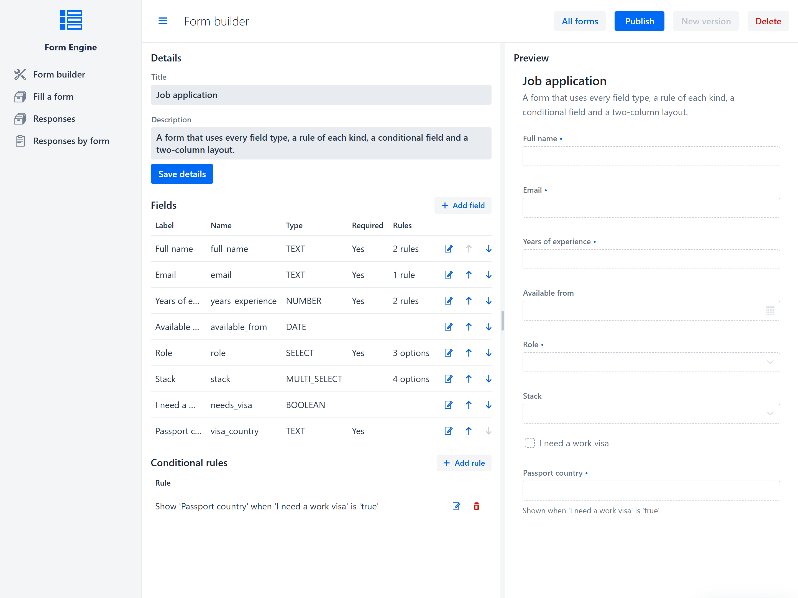
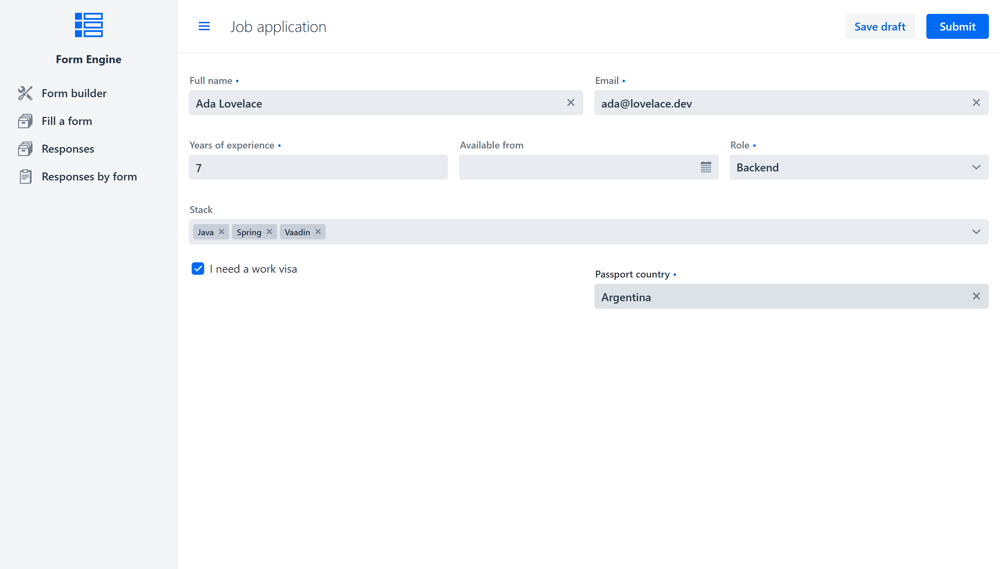
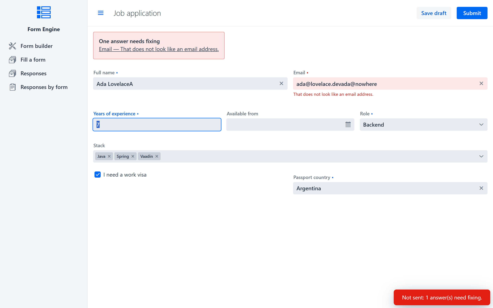
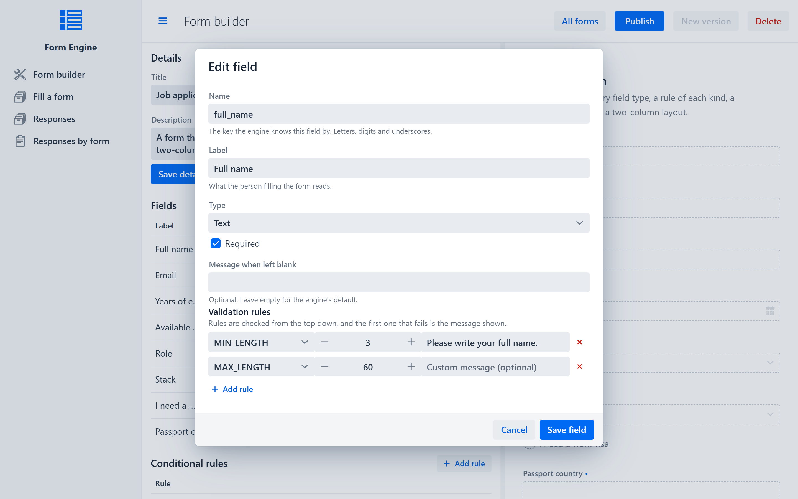
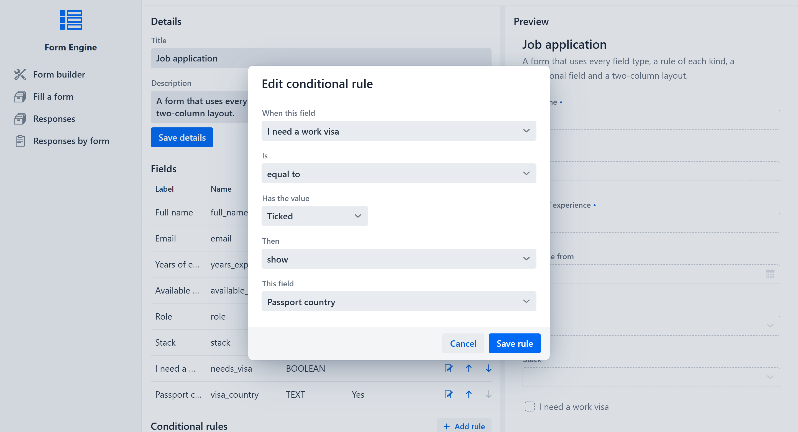
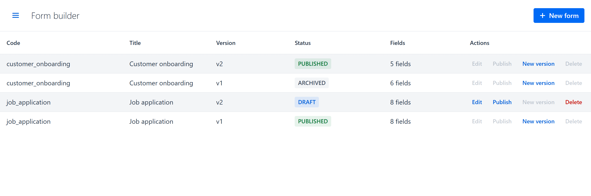
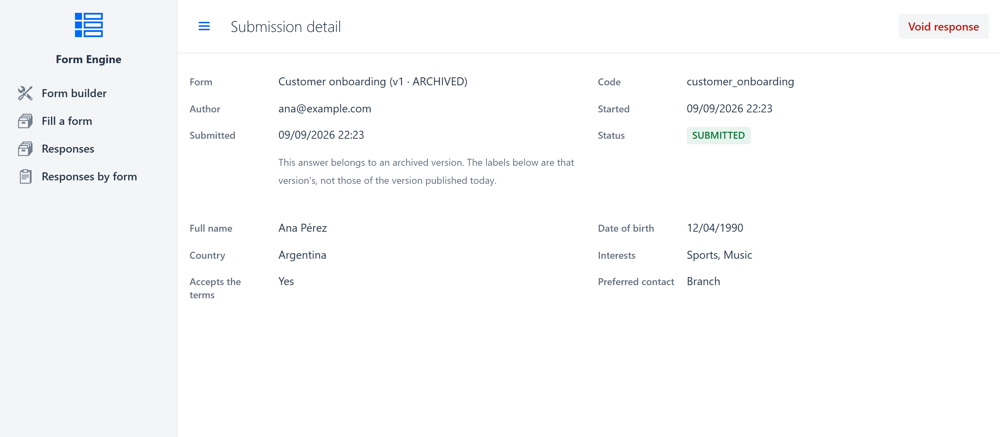
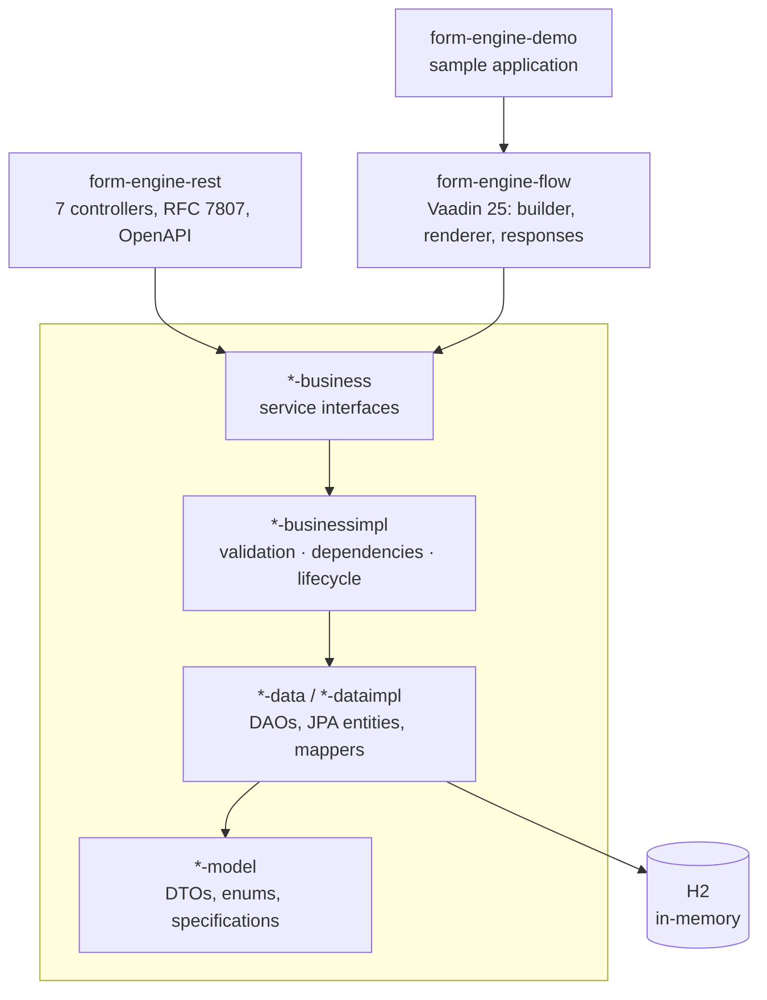
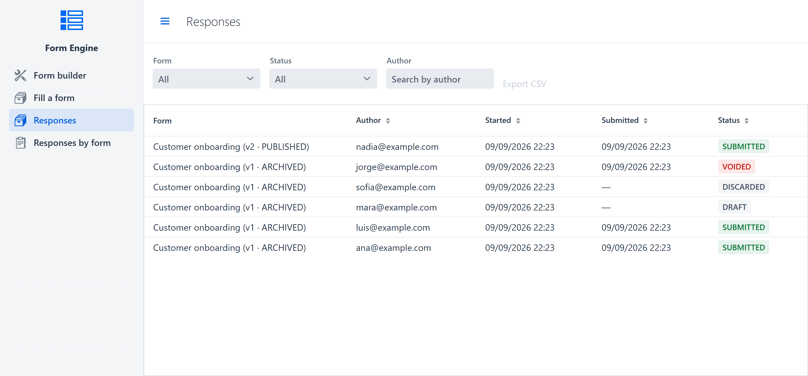
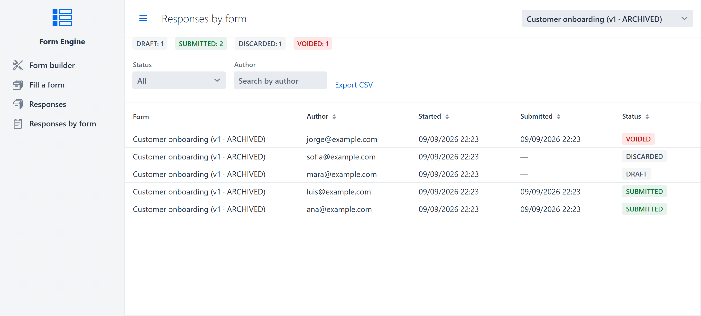

# Form Engine

[](https://github.com/Nc707/form-engine/actions/workflows/ci.yml)

A form engine whose forms are **defined at runtime, not at compile time**. A form definition owns its
fields, their options, their validation rules and the conditional dependencies between them; people
fill those forms in and their answers are stored against the exact version of the definition they saw.

Adding a rule to a form is an edit to data. No deployment, no code.

Java 21, Spring Boot 4.0.2, Vaadin 25, Maven multi-module, H2 in-memory.

## Screenshots

<table>
<tr>
<td width="34%"></td>
<td width="33%"></td>
<td width="33%"></td>
</tr>
<tr>
<td><sub>Design a form: fields, rules and conditional dependencies, with a live preview that mirrors the renderer exactly.</sub></td>
<td><sub>Fill in a published form. <code>visa_country</code> only appears once <code>needs_visa</code> is ticked.</sub></td>
<td><sub>The same rules the REST API enforces, reported field-by-field instead of as an exception.</sub></td>
</tr>
</table>

## What it does

**Validation is data.** A field carries a list of restrictions — `MIN_LENGTH`, `PATTERN`, `EMAIL` and
so on — which are turned into composable `FieldSpecification` objects at evaluation time. Two things
are deliberately *not* restrictions, because they are always true and so would be nothing to configure:
whether an answer is required at all, and whether a choice is one the field offers. See
[the specification guide](form-engine-definition-model/src/main/java/com/nc/formengine/model/specification/README.md).



<sub>Rules are checked top to bottom; the first one that fails is the message the person filling the
form sees.</sub>

**The engine owns its rules.** A form's coherence — field names usable as keys and unique within the
form, a select with options, an option value no answer could ambiguate, a rule that applies to its
field's type and carries the parameter it needs — is enforced in the business layer. The REST API and
the Vaadin UI are two consumers of it, held to the same standard; the builder asks the same questions
early so a problem is a message beside the field rather than an exception after pressing save.

**Fields react to each other.** A dependency says "while field A `EQUALS` *x*, `SHOW` / `REQUIRE`
field B". The evaluator resolves the whole graph, detects cycles, and where two satisfied rules
disagree the more restrictive one wins — so the outcome never depends on load order and a
misconfigured form fails closed.



<sub>"While <code>needs_visa</code> is ticked, show <code>visa_country</code>" — the rule behind the
field appearing in the fill-in screenshot above.</sub>

**Definitions have a lifecycle.** A `DRAFT` is editable, and cannot be published while it has no fields.
Publishing freezes it *whole* — not only its own row but its fields, their options, their rules and its
layouts — and archives whichever version was live before, so exactly one version per code accepts
submissions at a time. Changing a published form means creating a new version, which deep-copies
everything and repoints the references onto the copies. Old submissions stay readable against the
definition they were actually filled under, which is the point of freezing rather than editing in place.

<table>
<tr>
<td width="55%"></td>
<td width="45%"></td>
</tr>
<tr>
<td><sub><code>job_application</code> has a live v1 and an editable v2 draft; <code>customer_onboarding</code>'s
v1 is archived under its published v2.</sub></td>
<td><sub>An answer to that archived v1, still labelled — and readable — the way the person who filled it
in actually saw it.</sub></td>
</tr>
</table>

**Submissions have a state machine.** `DRAFT → SUBMITTED → VOIDED`, and `DRAFT → DISCARDED`. The two
endings are different acts by different people: a draft is *discarded* by whoever was filling it in,
nothing having been sent; a received response is *voided* by whoever owns the form, its answers staying
readable. Which one applies follows from where you are, so neither needs to be told who is asking.

Submitting validates strictly inside the transaction that writes, so a stored `SUBMITTED` row is
always one its own definition would accept — and it stays that way, because the state is the
lifecycle's alone and a submitted response's answers can no longer be edited. An invalid submit is not
an exception — being told which fields to fix is the normal outcome — so it comes back as a result
carrying the errors, with nothing written.

## Architecture

The project is sliced by domain, then by layer. The REST API and the Vaadin views are two consumers
of the same business core; neither owns engine logic. The views are a library of their own, and the
demo is an application that consumes it the way anyone else's would.



Each of `definition` and `submission` has its own `model / data / dataimpl / business / businessimpl`
column. The submission slice reaches into the definition slice in exactly one place — the submission
workflow needs to validate against a definition — and only at the business layer, one way. The
entities on both sides stay decoupled: a submission stores a plain `formDefinitionId` with no foreign
key.

| Module | What lives there |
|---|---|
| `*-model` | DTOs, enums, domain exceptions, the specification framework |
| `*-data` | DAO interfaces |
| `*-dataimpl` | JPA entities, repositories, mappers, DAO implementations |
| `*-business` | Service interfaces |
| `*-businessimpl` | Service implementations |
| `form-engine-rest` | REST API — port 8080, context path `/form-engine` |
| `form-engine-flow` | Vaadin views and components, packaged to be added to any Spring Boot application |
| `form-engine-demo` | A sample application built on that library — port 8081, injects the services directly (no HTTP) |

Every module registers its own beans, entities and repositories through Spring Boot
auto-configuration. That is why neither application above declares a `@ComponentScan`, an
`@EntityScan` or an `@EnableJpaRepositories`, and why yours does not have to either.

## Running it

The shortest way in is Docker, which needs nothing else installed — no JDK, no Maven, no Node. The
image is built from this repository; it is not pulled from a registry, because nothing here is
published to one.

```bash
docker compose up          # Vaadin UI → http://localhost:8081
```

The first run takes a few minutes: it compiles all thirteen modules and the Vaadin production
bundle inside the container. After that the build is cached. The demo runs on H2 in-memory there
too, so stopping the stack discards whatever was entered — the seeded forms are rebuilt on the next
start, so it always opens on something to look at.

With a JDK 21 and Maven on the machine, the modules run directly, and the REST API with them:

```bash
mvn clean install -DskipTests              # full build without having to wait for every test to run
mvn spring-boot:run -pl form-engine-demo   # Vaadin UI  → http://localhost:8081
mvn spring-boot:run -pl form-engine-rest   # REST API   → http://localhost:8080/form-engine
```

`form-engine-flow` is a library and has nothing to run; the demo above is what runs it.

The demo seeds two forms on startup, so there is something to look at immediately:

| View | What it is |
|---|---|
| **Form builder** | Design a form: fields, restrictions, options, conditional dependencies, live preview, publish, version |
| **Fill a form** | Render a published form on its layout grid, react to dependencies as you type, save a draft, submit |
| **Responses** | Browse and filter submissions, read one in full, export CSV, discard a draft or void a response |
| **Responses by form** | One form's submissions, with a per-status summary |

<table>
<tr>
<td width="50%"></td>
<td width="50%"></td>
</tr>
<tr>
<td><sub>Every submission across every form and version — <code>DRAFT</code>, <code>SUBMITTED</code>,
<code>DISCARDED</code>, <code>VOIDED</code> side by side.</sub></td>
<td><sub>The same data scoped to one form, with the per-status counts the full list doesn't total for
you.</sub></td>
</tr>
</table>

Two notes on partial builds:

- Always pass `-am` when building a single module (`mvn verify -pl form-engine-rest -am`). Without it
  Maven resolves the siblings from `~/.m2` instead of the reactor, and a stale `0.0.1-SNAPSHOT`
  installed there gets used instead of your working tree.
- `mvn -Pproduction ...` compiles the Vaadin frontend bundle. It is a separate profile on purpose:
  the default build must not need a Node toolchain.

## Using it in your own application

`form-engine-flow` is the package to add. It brings the views, the components and the whole engine
behind them.

```xml
<dependency>
    <groupId>com.nc</groupId>
    <artifactId>form-engine-flow</artifactId>
    <version>0.0.1-SNAPSHOT</version>
</dependency>
```

**That version does not resolve from anywhere yet.** Nothing here is published — not to Maven
Central, not to a snapshot repository, not to GitHub Packages — so adding no `<repository>` block is
not an omission: there is none to point at. Build the artifacts into your own `~/.m2` first, and the
coordinates above resolve from there:

```bash
git clone https://github.com/Nc707/form-engine.git
cd form-engine
mvn clean install
```

Then an ordinary Spring Boot application and a datasource. That is all:

```java
@SpringBootApplication
public class MyApplication {
    public static void main(String[] args) {
        SpringApplication.run(MyApplication.class, args);
    }
}
```

No `@ComponentScan`, no `@EntityScan`, no `@EnableJpaRepositories`, no `@EnableVaadin`. The views
mount themselves and are wrapped in your `@Layout` if you have one. Out of the box:

| Path | View |
|---|---|
| `form-engine/definitions` | Every form and version, with its actions |
| `form-engine/builder/{formId}` | The editor for one definition |
| `form-engine/forms` | The published forms, and your saved drafts |
| `form-engine/fill/{formId}/{submissionId}` | The renderer |
| `form-engine/responses` | Every submission |
| `form-engine/responses/form/{formId}` | One form's submissions |
| `form-engine/responses/submission/{id}` | One submission in full |

**Moving them.** The prefix and each segment are properties, so the paths are yours:

```properties
formengine.flow.routes.prefix=admin/forms   # everything moves under admin/forms/
formengine.flow.routes.forms=fill-in        # .../fill-in instead of .../forms
formengine.flow.routes.enabled=false        # no routes at all; beans and components stay
```

**The menu.** The module ships no `@Menu` annotations: they would fix the order, the title and the
icon inside the jar, where you could not reorder them against your own views or translate them. Build
the items yourself, by class — the URL is resolved from wherever the view was mounted:

```java
FormEngineViews.TOP_LEVEL.forEach(view ->
        nav.addItem(new SideNavItem(view.suggestedTitle(), view.navigationTarget())));
```

**Who is filling the form in.** Submissions are stored against an author, and the drafts to resume
are that author asked back. The default files everything under `formengine.flow.default-author`;
an application with accounts answers properly:

```java
@Bean
SubmissionAuthorProvider submissionAuthorProvider() {
    return () -> SecurityContextHolder.getContext().getAuthentication().getName();
}
```

That is identity, not authorisation: the responses views show every author's submissions to whoever
opens them, and anyone who reaches the builder can publish. Access control is yours to add.

**If your application already configures these things:**

- an explicit `@EntityScan` must also list `com.nc.formengine.dataimpl.entity` and
  `com.nc.formengine.submission.dataimpl.entity`;
- an explicit `@EnableJpaRepositories` must also list `com.nc.formengine.dataimpl.repository` and
  `com.nc.formengine.submission.dataimpl.repository`;
- an explicit `@EnableVaadin` or `vaadin.allowed-packages` should include
  `com.nc.formengine.flow`. Neither is needed for the routes, which are registered rather than
  scanned for.

**Licensing.** This is AGPL-3.0. Linking `form-engine-flow` into an application you serve over a
network puts that application under section 13, which is a real obligation and not a formality.

## API documentation

With the REST module running:

- Swagger UI — <http://localhost:8080/form-engine/swagger-ui.html>
- OpenAPI document — <http://localhost:8080/form-engine/v3/api-docs>

Endpoints are grouped under seven tags, all below `/api/v1`:

| Base path | Resource |
|---|---|
| `/api/v1/form-definitions` | Forms: code, title, version, status |
| `/api/v1/field-definitions` | The fields of a form |
| `/api/v1/field-options` | Options of `SELECT` / `MULTI_SELECT` fields |
| `/api/v1/field-dependencies` | Show/hide/require rules between fields |
| `/api/v1/form-layouts` | Per-device grid layouts, with fallback resolution |
| `/api/v1/form-submissions` | Filled-in instances of a form |
| `/api/v1/field-submissions` | The individual answers inside a submission |

The lifecycle and validation operations are deliberately **not** exposed over REST — they are driven
through the Vaadin UI against the same service interfaces. That is a choice about surface area, not a
gap the CRUD endpoints quietly fill: they cannot move a submission between states. Creating one always
yields a `DRAFT`, whatever status the request names, and submitting, discarding and voiding exist only
on the workflow service, which validates and checks that the form still accepts answers.

## Error model

Errors are RFC 7807 problem details, served as `application/problem+json` by a single
`@RestControllerAdvice` (`GlobalExceptionHandler`).

| Status | When |
|---|---|
| `400` | Bean Validation failed, a path variable had the wrong type, the body was unreadable, or a domain argument was invalid |
| `404` | The addressed resource, or one it references, does not exist |
| `409` | Something is already taken — a form code, a field name within its form, an option value within its field — or the request is against the state: editing any part of a published form, publishing twice, versioning a draft, submitting to a form that is not live, ending a submission that has already ended, writing answers to one that was already sent |
| `422` | Well formed but breaks a domain rule — a code or field name unusable as a key, a select with no options, a rule that does not apply to its field's type or is missing the parameter it needs, a minimum above its maximum, publishing a form with no fields, a layout referencing fields of another form |
| `500` | Anything unexpected. The detail is generic; the stacktrace goes to the log, never to the client |

```json
{
  "type": "https://form-engine/errors/not-found",
  "title": "Resource Not Found",
  "status": 404,
  "detail": "Form not found with id: 42",
  "instance": "/api/v1/form-definitions/42",
  "timestamp": "2026-08-09T00:04:11.238Z"
}
```

`400` and `422` add an `errors` array — one entry per violated constraint
(`{field, message, rejectedValue}`) or per broken rule.

## Tests

422 tests, all run by `mvn install` and by CI.

| Where | What it covers |
|---|---|
| `form-engine-definition-model` | Every specification on its own, the factory, the registry, how an answer is written down |
| `form-engine-definition-dataimpl` | What survives the database: restrictions, options, and that a new version shares no row with the one it was copied from |
| `form-engine-definition-businessimpl` | The dependency graph and its cycles, validation decisions, the definition lifecycle, and every invariant the domain now enforces rather than the builder |
| `form-engine-submission-*` | The submission state machine, and that writing a submission back does not delete the answers the request said nothing about |
| `form-engine-rest` | The API through `MockMvc`: status codes, problem bodies, the springdoc integration, and that the domain rules hold on the HTTP path too |
| `form-engine-flow` | The builder's policy and parameter names, the layout grid, answer resolution against archived versions, the renderer's save/submit workflow — and that an application configuring nothing gets working views without losing its own entities |

## License

Copyright © 2026 Nicolás Courtalón.

This program is free software: you can redistribute it and modify it under the terms of the **GNU
Affero General Public License**, either version 3 of the licence or, at your option, any later
version. The full text is in [LICENSE](LICENSE). It is distributed in the hope that it will be
useful, but WITHOUT ANY WARRANTY — without even the implied warranty of MERCHANTABILITY or FITNESS
FOR A PARTICULAR PURPOSE.
